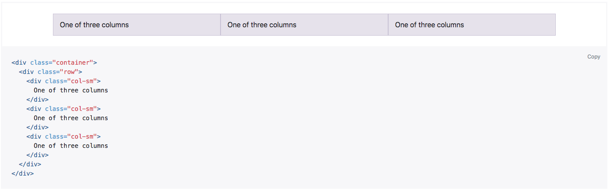

## Intro to Bootstrap
What is Bootstrap?
- Bootstrap is an open source toolkit for developing with HTML, CSS, and JS. Quickly prototype your ideas or build your entire app with our Sass variables and mixins, responsive grid system, extensive prebuilt components, and powerful plugins built on jQuery.

#### Getting your basic App set up with React
1. Create a new folder in your sites app.
1. Move into that folder and type: `create-react-app .` inside terminal to create a new react app.
1. Type `npm install` in the terminal to install the dependencies for React.
1. After these have loaded, type `npm start` in the terminal to check the React install.
1. Inside same folder, type: `npm install bootstrap --save` to install bootstrap from the NPM registry. The --save flag stores a record of this installation to your package.json file.
1. Type `npm install jquery --save` to install jquery, which is required by Bootstrap.
1. Type `npm install popper.js@^1.12.9`, which is also required by Bootstrap.
1. Inside the `src` folder delete all files except for `App.js` and `index.js`
1. Inside `App.js` remove `import logo from './logo.svg';`, `import './App.css';` and ``;
1. Inside `index.js` remove `import './index.css';`, `import registerServiceWorker from './registerServiceWorker';`, and `registerServiceWorker();`
1. The app should rebuild with no visual styles, but with the page title of 'Welcome to React'.

#### Adding Bootstrap
We will be building the main Bootstrap CSS file from the .scss source files, which are in the `node_modules` folder. (This is where we installed them in the first step)

1. Create a folder called `scss` inside of `src` and then create a file called `main.scss` — this is our primary .scss file which will call all other .scss files and compile these files into one .css file which our app will import for styling.
1. Inside of main.scss type `@import "node_modules/bootstrap/scss/bootstrap.scss";` This will import all of Bootstraps `*.scss` files, which are then compiled by Node sass.
1. Install Node sass by typing `npm install node-sass --save` in the terminal. Node sass is what compiles our .scss files into .css files needed by the web page.
1. Open the package.json file in the root of our project and find the spot where it says: 'scripts'.
1. Delete the lines `"test": "react-scripts test --env=jsdom"`, and `"eject": "react-scripts eject"`. We won't be using these, so let's get rid of them.
1. Create a new script by adding: `"build-css": "node-sass src/scss/main.scss src/main.css"`as a new script, after the `build` script. This creates a new NPM script with the name of `build-css` and tells node-sass to take the `src/scss/main.scss` file and compile it to `src/main.css`. Since `src/scss/main.scss` imports Bootstrap, this compiles ALL of Bootstrap's 30 or so .scss files.
1. Test this new script by typing `npm run build-css` into the terminal. You should see `main.css` appear in the `src` directory. Open this file and look at the compiled contents.
1. Now open `index.js` and import this compiled css file in our app by typing `import './main.css';` above `import App from './App';`, so we can see the CSS rendered on the web page.
1. You should notice how the font looks slightly fif

#### Customizing our app
1. Let's setup a responsive grid system, and center our existing content. To do that we will use [Bootstrap's grid system](https://getbootstrap.com/docs/4.0/layout/grid/).
1. Go to Bootstrap 4.0's grid system [here](https://getbootstrap.com/docs/4.0/layout/grid/).

1. Click on the copy link in the right corner of the HTML you see under How it Works
1. Paste this HTML just before the closing App div in your app.
1. Change `class` to `className` in each of the 5 instances in order to be React compliant.
1. You now should see the text 'One of three columns` repeated three times in a row.
1. This is a small example of the Bootstrap grid, which consists of a `.container`, a `.row`, and a `*-col` class. In our case it is a `col-sm` class.

